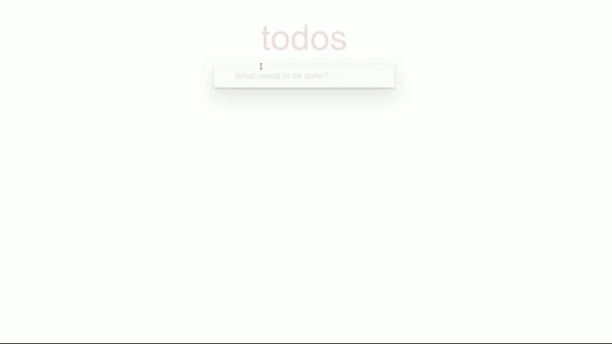

# A TypeScript-powered Todo List in React

TodoApp is a sleek and efficient task management application built with React and TypeScript. With TodoApp, you can effortlessly organize your tasks, set priorities, and track your progress—all within an intuitive and responsive interface. TodoApp is your perfect companion for staying productive and on track.



## Technologies Used

In developing my Todo App, I utilized a range of modern web technologies to create an efficient and visually appealing application.

**React:**

I used React extensively, focusing on functional components for a modular codebase. Key features include:

- **Global State Management with useContext and TypeScript:** Managing global state with useContext and defining types with TypeScript.
- **State and Effect Hooks:** Utilizing useState for component state and useEffect for side effects.
- **Controlled Components:** Managing form inputs dynamically with useState and onChange.

**Asynchronous Operations:**

For asynchronous operations, I employed:

- **REST API Requests:** Integrating with a server for CRUD operations.
- **Promise, async/await, and Error Handling:** Using Promise, async/await, and try/catch for robust data fetching.

**Styling:**

To enhance the UI, I used:

- **Bulma.css:** For a clean and responsive design.
- **FontAwesome:** Adding intuitive icons for better UX.

**Animations:**

I implemented animations using:

- **React Transition Group:** Providing smooth transitions for TodoList items.
These technologies collectively ensure my Todo App is functional, efficient, and user-friendly.
## Demo

Click the button below to experience the Todo App:

[DEMO](https://julwer1k.github.io/todo_app/)

[Design Original Version](https://todomvc.com/examples/javascript-es6/dist/)
## Run Locally

This project uses Node.js 14. Switching to it ensures compatibility with project dependencies. Refer to [Node.js download](https://nodejs.org/en/blog/release/v14.21.3) for installation instructions.

Clone the project

```bash
  git clone https://github.com/julwer1k/todo_app.git
```

Go to the project directory

```bash
  cd todo_app
```

Install dependencies

```bash
  npm install
```

Start the server

```bash
  npm run start
```

Check linter [HTML, JavaScript, CSS]

```bash
  npm run lint
```
